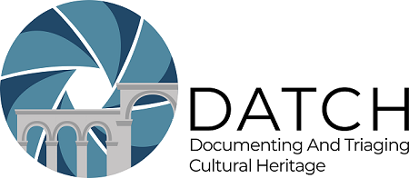

---

The Documenting and Triaging Cultural Heritage (DATCH) project is an open-source platform for field assessment and documentation of built and movable cultural heritage using mixed reality hardware. This repository is the offical DATCH **documentation**. For general information about the project visit [**https://sciences.ucf.edu/anthropology/datch/**](https://sciences.ucf.edu/anthropology/datch/).

For the offical source code for DATCH, visit [**the official DATCH GitHub repository**](https://github.com/datch-ucf/datch).

* [**DATCH Build Setup:**](build-setup.md)  Setting up Visual Studio to build and install Universal Windows Platform applications to the Microsoft HoloLens
* [**DATCH Hololens Deploy Guide:**](deploying-hololens.md) Deploying an App Package for HoloLens 
* [**DATCH Userguide (functionality):**](datch-functionality.md) DATCH Functionality 
* [**DATCH developer resources:**](resources.md) information on general HoloLens AR developer resources and Unity information. 
* [**DATCH adding shapefiles:**](adding-shapefiles.md) instructions on how to add shapefiles to the DATCH AR platform. 