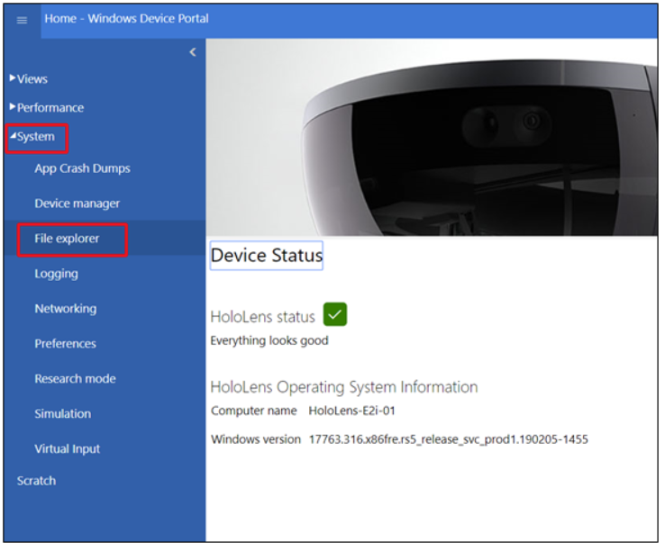
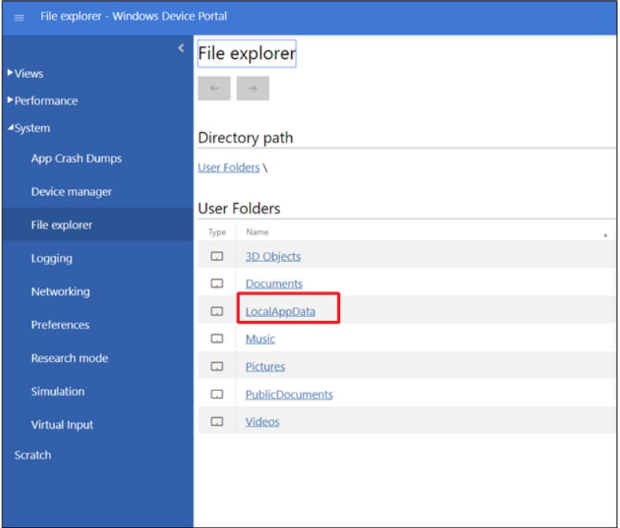
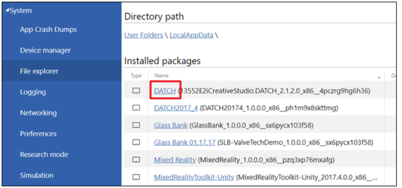
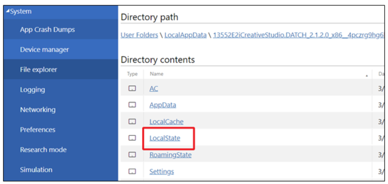
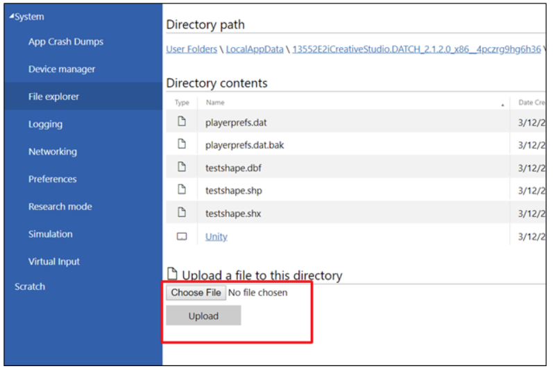

---

The Documenting and Triaging Cultural Heritage (DATCH) project is an open-source platform for field assessment and documentation of built and movable cultural heritage using mixed reality hardware. This repository is the offical DATCH **documentation**. For general information about the project visit [**https://sciences.ucf.edu/anthropology/datch/**](https://sciences.ucf.edu/anthropology/datch/).

For the offical source code for DATCH, visit [**the official DATCH GitHub repository**](https://github.com/datch-ucf/datch).

---

# Adding Shapefiles to DATCH 

To add your own shape file to the DATCH application, you will need to do so through the windows device portal.  

1. Connect your HoloLens to a USB port on your PC then navigate to http://127.0.0.1:10080. 
2. A pop up will appear requesting credentials.  E2i has set this up for you, with the following:   **Username:** DatchUCF **Password:** datch2018
3. Select System > File explorer 
4. In File explorer, under User Folders, select LocalAppData  
5. In LocalAppData, select “DATCH” under “Installed packages”.   
6. Select “LocalState” under “Directory contents”.  
7. Inside LocalState you will see a “Upload a file to this directory” section. Using the “Choose File” option, add your .dbf, .shp and .shx (individually).  
8. Close the File explorer and open the DATCH application. Using the “Open” function from the menu, your shape file (which is comprised of the .dbf, .shp, and .shx files you just uploaded) will be available in the list of files to open. 