---

The Documenting and Triaging Cultural Heritage (DATCH) project is an open-source platform for field assessment and documentation of built and movable cultural heritage using mixed reality hardware. This repository is the offical DATCH **documentation**. For general information about the project visit [**https://sciences.ucf.edu/anthropology/datch/**](https://sciences.ucf.edu/anthropology/datch/).

For the offical source code for DATCH, visit [**the official DATCH GitHub repository**](https://github.com/datch-ucf/datch).
--

# DATCH Build Setup  

This will guide you through setting up Visual Studio to build and install Universal Windows Platform applications to the Microsoft HoloLens.  (*Make sure your PC is running Windows 10.)

1. Download and Install Visual Studio 2017 Community  Go to [https://www.visualstudio.com/downloads/](https://www.visualstudio.com/downloads/) and select the “Free download” button beneath the Visual Studio Community 2017 heading. 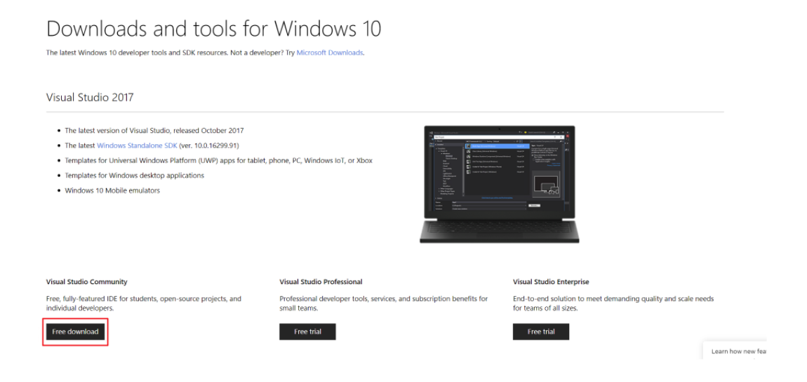
2. A Visual Studio Installer pop-up will appear. Please read their terms, then select the “Continue” button. 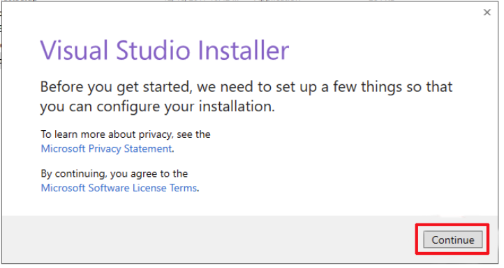
3. If applicable, an “Update available” prompt may appear. If it does, select the “Update” button to proceed. 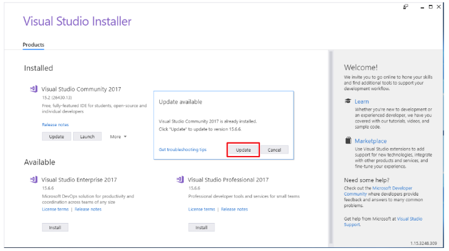
4. You will then be prompted to reboot. Please make sure you have saved any open files on your machine, then select the “Restart” button to complete this step. 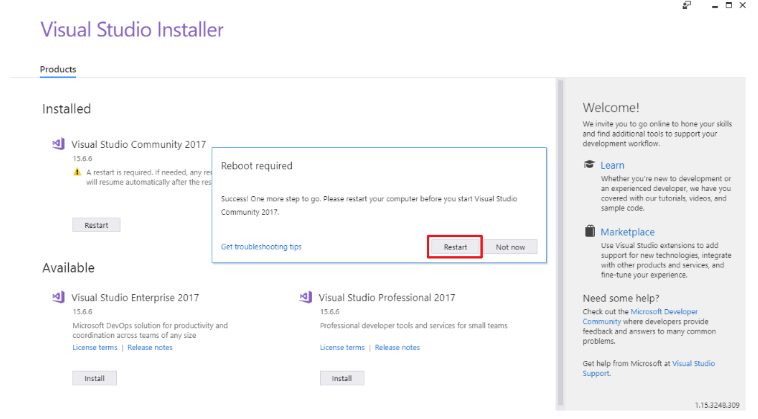
5. Once your computer has restarted, return to the Visual Studio Installer and select the “Modify” button beneath the “Installed” heading. 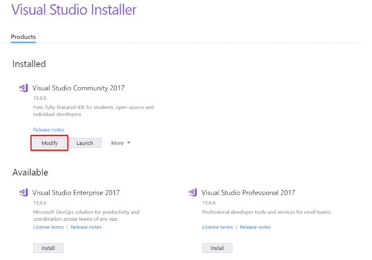
6. Select the two components checked in the following example, then select the “Modify” button on the lower right-hand corner. 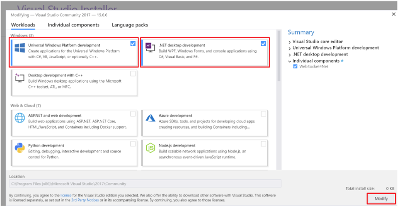

Your environments are all set up now. Continue to deploying app to the HoloLens. 

Before we continue deploying the app to the HoloLens, we have to setup the developer options on your PC and HoloLens 

# PC Developer Settings 

1. On your PC, search in the windows search bar for developer settings. 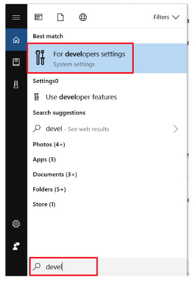
2. Turn on “Developer mode”. That is it for setting up the developer option. 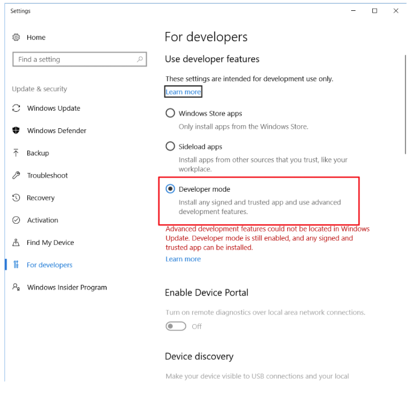

# HoloLens Developer Settings
1. In you HoloLens, go to your settings 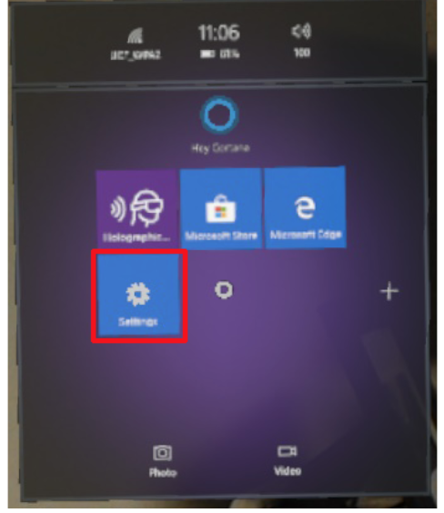 
2. Click on Update and Security option  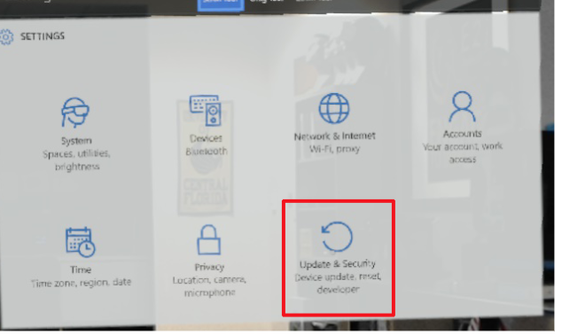 
3. Turn on developer mode  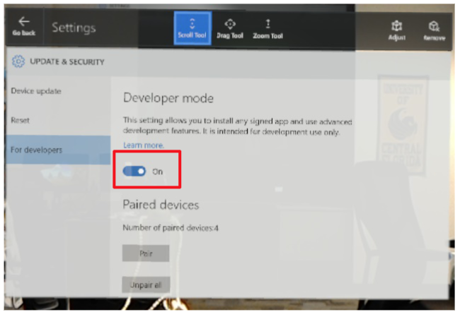 
4. Scroll down and turn on device portal option 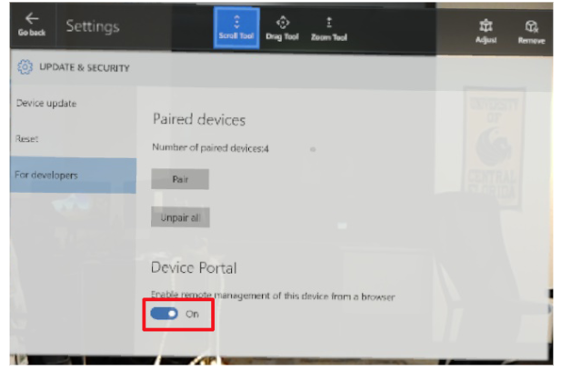 
