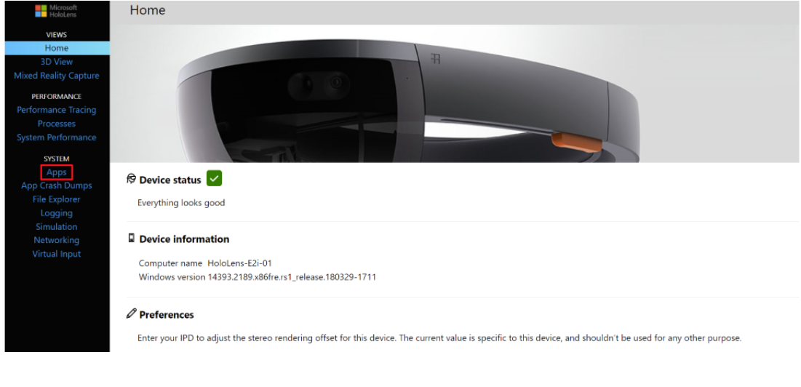
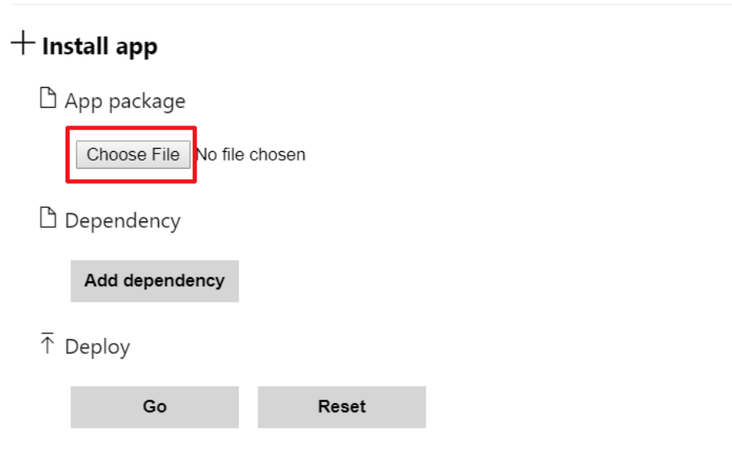
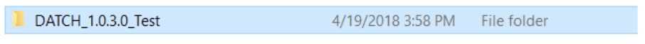
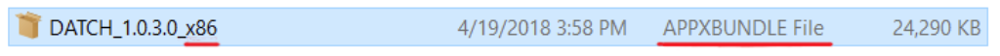
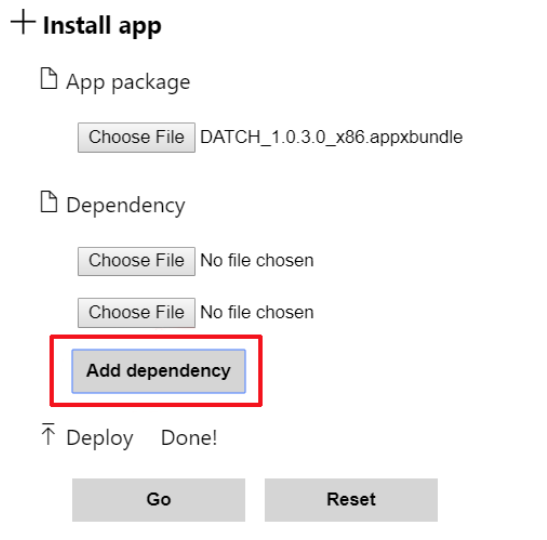
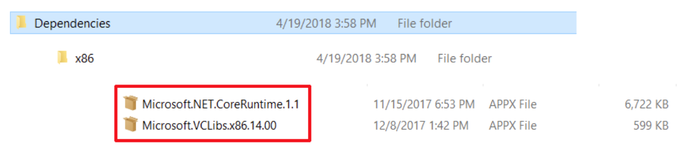
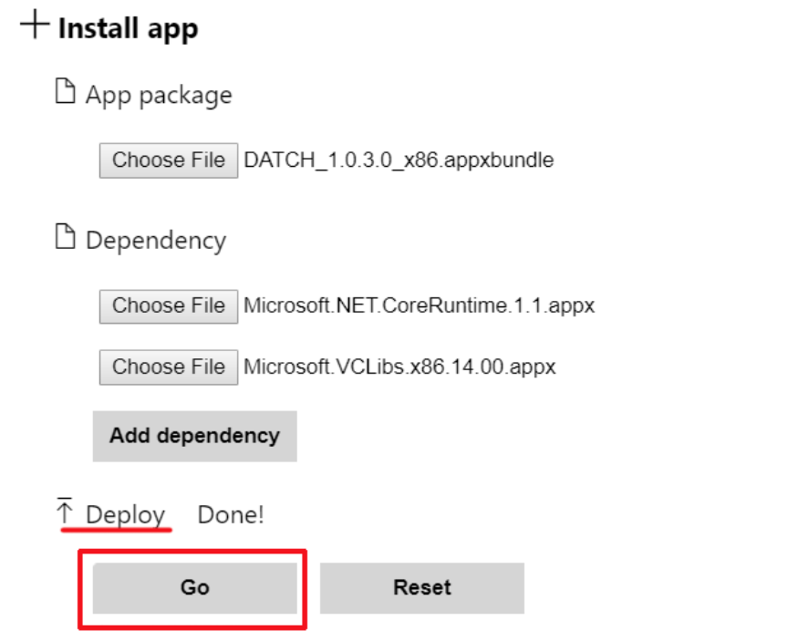

---

The Documenting and Triaging Cultural Heritage (DATCH) project is an open-source platform for field assessment and documentation of built and movable cultural heritage using mixed reality hardware. This repository is the offical DATCH **documentation**. For general information about the project visit [**https://sciences.ucf.edu/anthropology/datch/**](https://sciences.ucf.edu/anthropology/datch/).

For the offical source code for DATCH, visit [**the official DATCH GitHub repository**](https://github.com/datch-ucf/datch).

---

# Deploying an App Package for HoloLens 

This will guide you through deploying an App Package for HoloLens for the DATCH project.

1. Connect your HoloLens to a USB port on your PC then navigate to http://127.0.0.1:10080. 
2. A pop up will appear requesting credentials.  E2i has set this up for you, with the following:   **Username:** DatchUCF **Password:** datch2018
3. Once logged in, the Windows Device Portal will appear. Select the “Apps” tab. 
4. In Apps > Install app > App Package, select the "Choose File" button. 
5. Locate and double-click the App Package folder you would like to install.  
6. Inside you will find an “APPXBUNDLE” file. Double-click that file.  
7. In Apps > Install app > Dependency,  you will need to select the "Choose File" button for each file located in a "Dependencies > x86" folder for the app. Select the "Add Dependency" button to access as many "Choose File" buttons as needed. 
8. Add the dependency  
9. In Apps > Install app > Deploy, select the "Go" button. The app will now be deployed to your HoloLens.  
10. You will receive a message that says “Done!”. 

**Your App in now Deployed and Installed onto your HoloLens.**

Navigate to where your apps are located in your HoloLens and click on the Executable to run the project. 